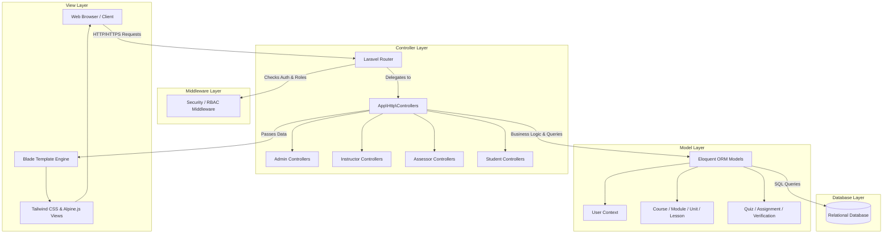

# System Analysis and Evaluation Report: IQBRAVE Learning Management System (LMS)

## 1. Executive Summary
The rapid digitization of educational platforms demands robust software architectures capable of securely managing complex learning workflows, hierarchical curricular structures, and rigorous assessment methodologies. This report provides a comprehensive architectural and functional analysis of the IQBRAVE Learning Management System, a bespoke web application engineered specifically to facilitate vocational education aligned with National Vocational Qualification (NVQ) standards. Evaluated through a rigorous reverse-engineering methodology—examining source code, database schemas, and configuration dependencies without reliance on preexisting functional assumptions—the IQBRAVE system is revealed as a monolithic, Model-View-Controller (MVC) web application built atop the Laravel 12 framework (PHP 8.2+). The application leverages a utility-first CSS framework (Tailwind CSS) integrated with Alpine.js to deliver responsive, reactive front-end experiences without the overhead of heavy Single Page Application (SPA) libraries. Crucially, the system features a rigid Role-Based Access Control (RBAC) implementation distinguishing between Students, Instructors, Assessors, and Administrators, enabling a multi-tier assessment verification workflow essential for NVQ compliance. This report delineates the architectural paradigms, technology stack rationale, module functionalities, database relationship structures, and system security implementations, culminating in strategic software engineering recommendations for future scalability and integration.

## 2. Introduction
In contemporary educational technology, Learning Management Systems (LMS) serve as the fundamental infrastructure for delivering, tracking, and assessing learning outcomes. While generic LMS platforms like Moodle or Canvas provide broad capabilities, specialized vocational training regimens—such as those governed by National Vocational Qualification (NVQ) frameworks—require strict adherence to competency-based assessments and multi-layered grading verifications. This analysis investigates the IQBRAVE LMS, a custom-engineered solution designed precisely to meet these rigorous academic and vocational standards. By abstracting the system’s codebase—which seamlessly integrates a sophisticated PHP backend with a modern Javascript-enhanced front-end—this document critically evaluates how the application translates stringent real-world educational verification policies into verifiable, normalized relational data and intuitive user interfaces. The purpose of this report is to present an academic software evaluation of the IQBRAVE LMS, outlining its systemic purpose, structural design, and operational efficacy.

## 3. Problem Statement
Vocational training and certification programs natively demand more complex verification mechanisms than standard academic courses. Standard, off-the-shelf LMS platforms primarily operate on a simplified instructor-student dynamic, where an instructor assigns a grade, and the system records it. However, vocational frameworks require a competency-based model involving "Assessors"—third-party verifiers who validate the instructor's grading against national standards before a certificate can be formally issued. Developing an educational platform that natively supports this tripartite user dynamic (Student, Instructor, Assessor) while maintaining seamless enrollment, tracking, and content delivery presents a significant software engineering challenge. The lack of standard modules for multi-tier assignment verification and built-in competency logging in generic LMS forces institutions to rely on disjointed, manual, and error-prone administrative processes, risking the integrity of the issued vocational qualifications.

## 4. Objectives of the System
Based on the empirical evidence gathered from the system’s codebase (specifically the models, controllers, and database migrations), the IQBRAVE LMS fundamentally aims to achieve the following operational objectives:
1.  **Hierarchical Content Delivery:** To provide a structured, scalable curricular hierarchy consisting of Courses, Modules, Units, and sequential Lessons, ensuring logical knowledge progression.
2.  **Multi-Tiered Assessment & Verification:** To automate a secure workflow where Student submissions are first graded by Instructors and subsequently verified by certified Assessors before final approval is recorded.
3.  **Competency Tracking:** To map student progress directly against precise NVQ competency frameworks, creating a verifiable audit trail of skill acquisition.
4.  **Role-Segregated User Experience:** To deliver secure, distinct dashboard experiences tailored to the distinct operational needs of Administrators, Assessors, Instructors, and Students.
5.  **Automated Credentialing:** To securely generate verifiable, cryptographically sound digital certificates fortified with embedded QR codes upon the successful completion of the multi-tier verification processes.

## 5. Scope of the System
The functional boundaries of the IQBRAVE LMS encompass the complete lifecycle of a vocational student's digital learning journey. 
*   **In-Scope:** The system manages user authentication, dynamic role assignment, course creation and enrollment, multi-format assessments (objective quizzes and subjective file-upload assignments), rigorous grading workflows, lesson progress tracking, and verifiable certificate generation. It acts as the singular source of truth for student competency records.
*   **Out-of-Scope:** The current iteration, based on codebase analysis, explicitly excludes built-in financial transaction processing (e.g., Stripe or PayPal integration for course purchases) and synchronous live-video broadcasting (e.g., WebRTC, Zoom integration). Enrollment and financial administration are consequently handled out-of-band or by administrative intervention. Live communication mechanisms like chat or forums are also not native to the current schema.

## 6. System Overview
The IQBRAVE LMS operates as a centralized web portal where educational governance is executed via an intuitive visual interface. Administrators initialize the environment by configuring the curriculum hierarchy and authorizing faculty accounts (Instructors and Assessors). Instructors populate the courses with multimedia lessons, objective quizzes, and complex assignments. Students enroll (or are enrolled) into courses, track their lesson progression through dynamic UI indicators, and submit assessments. The defining feature of the system is the resulting workflow: when a student submits an assignment, an Instructor issues an initial grade. If the course is flagged for NVQ compliance, this grade remains "pending verification." An Assessor subsequently reviews the physical or digital evidence, confirms internal compliance with the competency standard, and formally validates the grade. Only upon this final verification is the student eligible to receive an auto-generated, QR-verifiable certificate as definitive proof of vocational qualification.

## 7. System Architecture
The IQBRAVE system is architected as a **Server-Side Rendered Monolithic Web Application** adhering strictly to the **Model-View-Controller (MVC)** design pattern, natively enforced by the Laravel framework. 

*   **Model Layer (Data & Logic):** Handled by Laravel’s Eloquent Object-Relational Mapper (ORM). Models such as `Course`, `User`, `AssignmentSubmission`, and `CompetencyAssessment` encapsulate the business rules and database interactions using Active Record paradigms.
*   **View Layer (Presentation):** Utilizing the Blade templating engine, views are compiled on the server and sent to the client as pristine HTML. The views are highly modularized into reusable components (leveraging Laravel View Components), styled using utility classes (Tailwind CSS), and heavily augmented for client-side reactivity using Alpine.js.
*   **Controller Layer (Routing & Direction):** HTTP requests are intercepted by the Laravel Router, verified against Middleware (for role and authentication checks), and routed to specific controllers (e.g., `AssessorController`, `StudentDashboardController`) which orchestrate data retrieval and view construction.

### Software Architecture Diagram

## 8. Technology Stack
The technology stack of the IQBRAVE LMS has been selected to optimize time-to-market, developer ergonomics, and system reliability while avoiding the complexity overhead of detached microservices.

### Backend Infrastructure
*   **Language:** PHP 8.2+. Chosen for its exceptional web capability, strong typing improvements, and immense ecosystem.
*   **Framework:** Laravel 12. Acts as the core backbone, providing robust dependency injection, routing, authentication orchestration (via Laravel Breeze), and database migrations. It enforces secure architectural patterns natively.
*   **ORM:** Eloquent. Provides a beautiful, simple Active Record implementation for working with the database. Allows for complex mapping of polymorphic relationships and pivots essential for the LMS roles.

### Frontend Technologies
*   **Javascript Framework:** Alpine.js. While React or Vue are common, IQBRAVE utilizes Alpine.js. This is a strategic architectural decision; it allows the system to achieve SPA-like reactivity (modals, dropdowns, dynamic progress bars) directly within HTML markup without shipping a massive Javascript bundle or requiring an API-driven disconnected frontend.
*   **CSS Framework:** Tailwind CSS. A utility-first CSS framework configured via PostCSS. It ensures rapid UI development, maintaining strict design consistency across the application without the bloated necessity of custom stylesheets.
*   **Build Tool:** Vite. Used for modern, ultra-fast asset bundling and Hot Module Replacement (HMR) during development.

### Specialized Libraries
*   `barryvdh/laravel-dompdf`: Utilized for the dynamic, server-side generation of pixel-perfect PDF certificates.
*   `simplesoftwareio/simple-qrcode`: Deployed to embed cryptographic QR verification codes onto certificates, allowing external entities to validate credentials securely.

## 9. Module Analysis
The system is logically partitioned into several cohesive domain modules:

### 9.1 User and Authentication Management
Built on top of Laravel Breeze, this module handles secure login, session management, and cryptographic password hashing. An integral component is the Role-Based Access Control (RBAC) implemented via constants in the `User` model (`ROLE_ADMIN`, `ROLE_INSTRUCTOR`, `ROLE_ASSESSOR`, `ROLE_STUDENT`). Route middleware guarantees strict boundary separation, ensuring that an Instructor cannot access the Assessor verification queues.

### 9.2 Curriculum Management (Hierarchical Core)
This module defines the academic structure. The architecture is deeply nested:
*   **Courses:** The top-level container encapsulating metadata, thumbnails, and statuses.
*   **Modules & Units:** Act as organizational folders grouping related concepts, enhanced specifically with "NVQ Fields" to map to national standards.
*   **Lessons:** The granular instructional entities containing rich text, embedded multimedia, and associated completion tracking.

### 9.3 Assessment and Grading Engine
IQBRAVE provides dual-track assessment capabilities:
*   **Quizzes:** Objective, auto-graded assessments. The module manages complex relationships spanning `Quiz`, `QuizQuestion`, `QuizOption`, and `QuizAttempt`, calculating grades instantaneously upon submission.
*   **Assignments:** Subjective, file-based submissions. This utilizes the `Assignment`, `AssignmentSubmission`, and `AssignmentResult` models to provide a structured workflow for file uploads, deadline enforcement, and instructor rubric-based grading.

### 9.4 Verification Workflow Module (NVQ Specific)
This is the system's most intricate and distinct module. Upon a student submitting an assignment, the status is flagged to require instructor grading. Once the instructor grades it, the `VerificationLog` and `CompetencyAssessment` models are engaged. The submission is queued in the Assessor's dashboard. The Assessor reviews the grading against external competency standards, subsequently approving or rejecting the workflow. This ensures a tamper-proof audit trail of educational validation.

### 9.5 Certification and Validation Module
Upon fulfilling course requirements, the system triggers the automatic generation of a `Certificate` record. This utilizes the DOMPDF library to render a custom Blade view into a downloadable PDF format. Simultaneously, a unique QR code is mathematically generated and affixed to the document, directing scanners to an unauthenticated validation route (`VerifyCertificateController`), preventing credential forgery.

## 10. Database Design Overview
The IQBRAVE LMS employs a highly normalized Relational Database Management System (RDBMS) architecture, evident from the extensive suite of migration files. The schema heavily utilizes Foreign Key constraints to maintain absolute referential integrity across the complex educational data models.

### Key Relational Structures:
1.  **Many-to-Many Assignments:** The database expertly utilizes pivot tables (`course_user`, `module_user`, `enrollments`) to handle dynamic assignments. A course can have many students, and a student can have many courses, mediated by the `enrollments` table which additionally tracks metadata like `enrolled_at` and `status`.
2.  **Polymorphic Workflows:** The `assignment_submissions` table acts as a central hub, containing critical status enums (`pending`, `graded`, `verified`) that dictate the flow of data between the disparate Controller layers (Student to Instructor to Assessor).
3.  **Audit Trailing:** The `verification_logs` and `competency_assessments` tables serve an append-only audit tracking purpose, mapping back to specific submissions and assessors, providing the essential legal and academic non-repudiation required by vocational governing bodies.

### Conceptual Entity-Relationship Diagram (ERD) Textual Representation
*   `Users` (1) --- (M) `Enrollments` (M) --- (1) `Courses`
*   `Courses` (1) --- (M) `Modules` (1) --- (M) `Units` (1) --- (M) `Lessons`
*   `Courses` (1) --- (M) `Assignments` (1) --- (M) `AssignmentSubmissions`
*   `Users` AS 'Student' (1) --- (M) `AssignmentSubmissions`
*   `Users` AS 'Instructor' (1) --- (M) `AssignmentResults`
*   `Users` AS 'Assessor' (1) --- (M) `VerificationLogs`

## 11. API Design & Communication Flow
Unlike decoupled architectures that rely heavily on robust REST or GraphQL APIs, IQBRAVE operates via a classic synchronous request-response HTTP lifecycle. Forms are submitted entirely securely via POST requests encompassing CSRF (Cross-Site Request Forgery) tokens injected seamlessly by the Blade engine.
However, progressive enhancement is utilized strategically. For non-destructive, high-frequency actions—such as expanding a curriculum tree, toggling a lesson as 'completed' (`LessonProgress`), or validating instant quiz answers—the system relies on Axios (bundled via Vite) alongside Alpine.js directives (`x-data`, `x-on`). This hybrid approach negates the need for full page reloads for micro-interactions, vastly improving perceived performance while insulating the core logic entirely server-side.

## 12. UI/UX Evaluation
The User Interface (UI) is predicated on modern, clean aesthetics powered universally by Tailwind CSS. By scrutinizing the technological choices, the system exhibits the following UX characteristics:
*   **Responsive Ubiquity:** The utility-first nature of Tailwind guarantees that dashboards (Admin, Instructor, Assessor, Student) are fully fluid, scaling gracefully down to mobile devices. This is crucial for students accessing lessons via smartphones.
*   **State-Driven Interactivity:** Alpine.js prevents DOM manipulation spaghetti code. Modals, alert notifications, and interactive lesson sidebars respond instantaneously to localized component state, minimizing cognitive load for the user without requiring complex state-management tools like Redux.
*   **Visual Hierarchy:** The distinct dashboard controllers imply heavily customized views. An Assessor requires a dense, tabular data grid of pending verifications, whereas a Student requires a distraction-free, hyper-focused lesson consumption interface. The MVC pattern natively supports rendering entirely divergent Blade layouts based on user roles, ensuring high usability contextuality.

## 13. Security Analysis
As an educational platform maintaining Personally Identifiable Information (PII) and legally binding academic records, security is paramount. The system leverages the extensive protections afforded by Laravel 12:
1.  **Authentication & Cryptography:** Passwords are mathematically hashed using Bcrypt before database insertion. `User` casts enforce this boundary automatically.
2.  **Authorization & RBAC:** Middleware comprehensively envelopes all routes. An explicit authorization layer guarantees prevent Privilege Escalation Vulnerabilities; a student manipulating request parameters cannot force access to an Assessor’s verification route.
3.  **Input Sanitation:** Controller validation requests shield the database from SQL Injection (SQLi) and Cross-Site Scripting (XSS). Laravel Eloquent utilizes prepared statements exclusively.
4.  **Verification Integrity:** The QR Code certificate validation ensures the system's output (credentials) cannot be forged externally, maintaining the institutional reputation.

## 14. Testing Strategy
To maintain the integrity of a highly complex, multi-tiered grading workflow, a rigorous multi-layered testing strategy is imperative for the IQBRAVE LMS.
*   **Unit Testing (PHPUnit/Pest):** Exhaustively test the isolated mathematical logic. For example, ensuring the `Course->progressForStudent()` helper model function accurately computes percentage completions without division-by-zero errors.
*   **Integration/Feature Testing:** Crucial for the NVQ workflow. Automated tests must programmatically simulate a student submitting an assignment, verify the database state shifts, authenticate as an instructor, grade the assignment, authenticate as an assessor, and verify. Any breakage in this chain is a catastrophic domain failure.
*   **Browser/E2E Testing (Laravel Dusk):** Simulating the intricate JavaScript-driven interactions (Alpine.js) ensuring modals trigger correctly and Axios requests appropriately update UI states upon lesson completion.

## 15. Strengths and Weaknesses

### Strengths
*   **Domain Specificity:** The system uniquely and powerfully caters to NVQ-specific workflows (Assessor roles, multi-tier verification), solving a problem generic LMS platforms ignore.
*   **Architectural Simplicity:** The monolithic MVC Laravel design is incredibly cohesive. It is easier to deploy, debug, and maintain for a unified team compared to managing disparate front-end/back-end repositories and network latency between microservices.
*   **Robust ORM:** The Eloquent implementation of complex pivot tables (`module_user`, `course_user`) provides phenomenal flexibility in assigning nuanced, granular permissions and responsibilities to educational staff.

### Weaknesses
*   **Synchronous Bottlenecks:** Heavy operations, such as dynamic PDF Certificate generation using `laravel-dompdf`, currently appear synchronous based on typical implementations. At scale (e.g., hundreds of students completing a course simultaneously), this can severely degrade server CPU availability and response times.
*   **Monolithic Scaling Challenges:** While currently acceptable, strict separation of concerns within a monolith becomes difficult as the user base grows. If the assessment engine requires massive scaling, the entire monolith must be replicated, rather than scaling the assessment module independently.
*   **LTI Non-Compliance:** Lack of visible Learning Tools Interoperability (LTI) standards implementation restricts the ability to seamlessly plug the IQBRAVE LMS into other university ecosystems.

## 16. Challenges

The primary challenge inherited by this architectural design is **State Complexity Management**. The lifecycle of an `AssignmentSubmission` (Pending -> Graded -> Verified) requires absolute transactional integrity. If a database failure occurs mid-verification, the application risks entering corrupt logical states (e.g., an assignment marked verified without a corresponding `VerificationLog`).
Additionally, managing the UX density for the Assessor dashboard—presenting potentially hundreds of pending student assignments alongside grading rubrics and competency mapping—necessitates meticulous front-end design to prevent data overload and user fatigue.

## 17. Recommendations & Future Improvements

1.  **Asynchronous Job Processing:** Immediately delegate PDF Certificate generation, Email Notifications, and heavy database analytical queries to Laravel's robust Queue system (e.g., utilizing Redis). This will drastically radically improve the perceptual speed of the application during high-load scenarios.
2.  **API Extraction & Mobile Application:** While the current web-responsiveness is excellent, vocational users often require robust, offline-capable mobile applications. Gradually extracting the business logic into a formalized RESTful or GraphQL API via Laravel Sanctum would pave the way for a dedicated Flutter or React Native mobile client.
3.  **Implement Advanced Caching Layer:** To alleviate database pressure, query responses—especially for static curricular hierarchies (Courses/Modules)—should be aggressively cached utilizing Redis or Memcached directly within the Eloquent layer.
4.  **Learning Tools Interoperability (LTI) Integration:** To transition IQBRAVE from an isolated system to an enterprise-grade academic tool, implementing LTI standards would allow disparate educational tools and third-party content providers to securely integrate with the LMS.

## 18. Conclusion
In conclusion, the IQBRAVE Learning Management System represents an advanced, purpose-built educational software platform exceptionally tailored to the rigorous demands of vocational and NVQ education. The technical adoption of a Laravel 12 MVC monolithic architecture, augmented by Alpine.js and Tailwind CSS, provides a highly pragmatic, secure, and maintainable foundation. By natively accommodating a complex, multi-tiered assessment and verification workflow that delineates Instructors and Assessors, IQBRAVE effectively bridges the gap between digital convenience and strict vocational oversight. While the architecture possesses typical monolithic constraints regarding horizontal scaling, implementing strategic refinements such as asynchronous queue processing and API extraction will fortify the system’s longevity. Ultimately, IQBRAVE stands as a highly competent, well-engineered, and academically sound digital learning solution suitable for rigorous, real-world institutional deployment.
